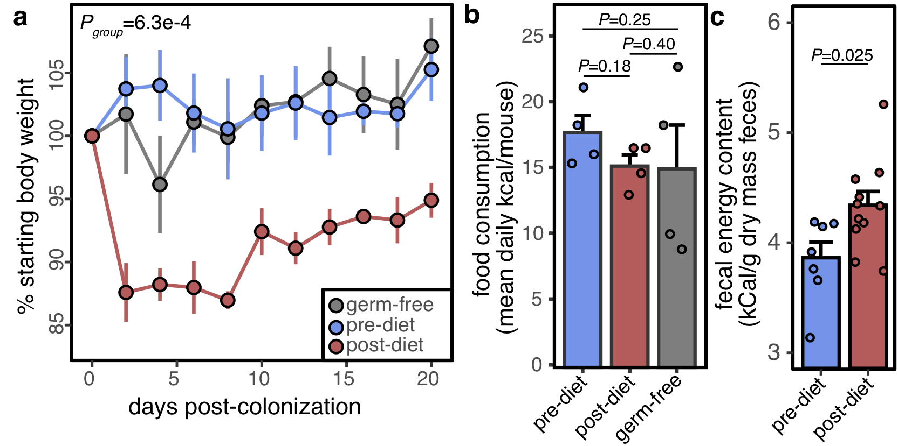

```{r setup, include=FALSE}
knitr::opts_chunk$set(echo = TRUE, cache = FALSE, message=F, warning=F)
```


# Background

The  goal of this tutorial is to give you a quick intro into the theory and practice of amplicon sequencing data and how to go from raw sequencing data to publication-quality figures/analysis. We will be focusing on 16S rRNA amplicon data, but you will see in later sessions, many of these concepts and techniques are relevant to other data types and fields!

For this session, we are going to emulate a fairly common scenario. The background of the data we will analyze today is that it is derived from gnotobiotic mice which were colonized using human samples from before and after a weight loss diet intervention. As is often the case in gnotobiotic fecal transplant experiments, we examined host phenotypes. Mice that received post-diet microbiomes demonstrated rapid and sustained weight loss (Panel A). Despite consuming similar amounts of food (Panel B), we found that the fecal caloric content was higher in post-diet mice suggesting a defect in nutrient absorption (Panel C). We used 16S rRNA amplicon sequencing of the V4 region to characterize the recipient microbiome to try to map which organisms could be responsible for the weight loss phenotype. We will be examining a subset of 3 mice from the pre-diet and post-diet groups at 4 time points across the experiment **to generate a hypothesis about which microbes in the post-diet microbiota are responsible for weight loss**.




***

# Preparing For Class

Before our session, please complete the sections below. The goal is for you to have downloaded all of the data and software ahead of time so we can focus on concepts and data interpretation rather than troubleshooting. That being said... installing software is often the most difficult part of bioinformatics, so please email `jordan.bisanz@psu.edu` if you run into difficulties. You will need access to a mac/windows/Linux machine with at least ~150 MB of free storage. If you can't access a computer, please let me know ahead of time and I can make an arrangement for you to remotely access a R studio session via your web browser.

## Installing R and R Studio

We will be making use of the R programming language which is commonly used across many fields for statistical analysis. To begin, please install and/or update to version of R (4.3.2 by downloading from the following [link](https://cran.rstudio.com/). R is commonly accessed through an easy-to-use interface called R studio. This can be downloaded [here](https://posit.co/download/rstudio-desktop/). R and many of the packages you would use for data analysis are updated on a regular basis, **please ensure you have the latest version of R.** 

If you are not familiar with R, it is an extremely useful tool for analyzing and visualizing data. If you are not familiar with it, please watch these videos before our class:

*  [Introduction to R Programming with Data Camp](https://www.youtube.com/watch?v=HkNFn6eosaU)
*  [Getting started with R and RStudio](https://www.youtube.com/watch?v=lVKMsaWju8w&t=3s)
*  If you are interested in learning more R, I recommend [this book](https://www.amazon.com/Data-Science-Transform-Visualize-Model/dp/1491910399/ref=sr_1_9?dchild=1&keywords=tidyverse&qid=1620329413&s=books&sr=1-9).


To ensure you have successfully installed the software, please open R studio and type the following code into your console:

```{r eval=F}
R.Version()$version.string
```

The expected output that should be reported is: `R version 4.3.2 (2023-10-31)`.

## Installing Required Packages

Generally speaking, most packages for microbial ecology exist in 3 places: CRAN, Bioconductor, and Github. CRAN is the main R repository from which packages can be installed using `install.packages()`. Bioconductor is a repository specializing in bioinformatics. Bioconductor packages are installed via its own package (available from CRAN) called BiocManager which has a function called `BiocManager::install()`. Finally, the newest versions of packages or in-development packages are often found on github which can be installed using a package called devtools which offers `devtools::install_github()`. To install the required packages, copy and past the code below line by line into your R session. If asked to compile type `yes` and if asked to update packages types `no`.

```{r, eval=F}
install.packages("tidyverse") # A group of related packages to facilitate a wide variety of useful tasks including plotting
install.packages("vegan") # A commonly used ecology package offering diversity calculations and statistical tests
install.packages("ape") # A package for phylogenetic analysis offering several useful functions for microbial ecology
install.packages("lme4") # A package for advanced statistical testing
install.packages("lmerTest") # A package for advanced statistical testing

install.packages("BiocManager") # The package manager for Bioconductor
BiocManager::install("dada2") # A one-stop-shop for processing amplicon data
BiocManager::install("phyloseq") # A R package for microbiome analysis

install.packages("devtools") # A multi-purpose tool for developing packages
devtools::install_github("jbisanz/qiime2R") # A multi-purpose microbiome import/processing package written by yours truly
```

After you have installed all of the above packages, it is a good idea to try loading them one by one as below. If a package fails to load, read the error message and then try to reinstall. Please contact me if there are issues which you can't resolve.

```{r message=F, warning=F}
library(tidyverse)
library(dada2)
library(phyloseq)
library(ape)
library(vegan)
library(qiime2R)
library(lme4)
```

## Downloading Data

We will start by creating a new directory for our project using the `dir.create()` function. I am going to place this on my desktop, but you might want to pick somewhere else depending on your computer:

```{r, eval=F}
dir.create("~/Desktop/BMMB521_tutorial") #Note: windows users would use dir.create("C:\Users\YourUserName\Desktop\BMMB521_tutorial")
```

Then we can specifically set our working directory to be inside this older as below:

```{r, eval=F}
setwd("~/Desktop/BMMB521_tutorial") #Note: windows users would use setwd("C:\Users\YourUserName\Desktop\BMMB521_tutorial")
```

### Reads

I am providing the sequencing data as a single compressed directory (a gzipped tarball). You could download it via R as below, or using your web browser by copying the link. 

```{r, eval=F}
download.file("https://github.com/jbisanz/BMS270_SP2021/raw/main/BMS270_SP2021_reads.tar.gz", "BMMB521_reads.tar.gz")
```

Now that we have downloaded the reads, we can unpack the folder as below:

```{r, eval=F}
untar("BMMB521_reads.tar.gz")
```

You will now see that a folder called reads has appeared. We can look at them in R using `list.files()`.

```{r}
list.files("reads")
```

### Metadata

Now that we have the reads, we need to know which samples they belong to! This is called metadata, and a spreadsheet (in tab separated format) is available to download as below. Note that you could just as easily use excel spread sheets; however, there are some special considerations for reading/writing excel files and they love to auto-convert text to dates which can cause issues.

```{r, eval=F}
download.file("https://github.com/jbisanz/BMS270_SP2021/raw/main/metadata.tsv","metadata.tsv")
```

We can now take a quick look at the metadata after reading it in:

```{r}
read_tsv("metadata.tsv")
```

### Taxonomy Database

Finally, we will download a database for taxonomic assignment (if we believe such a thing is valuable). We will be using the RDP database; however, we will discuss alternate (and perhaps better) choices during the tutorial.

```{r, eval=F}
download.file("https://zenodo.org/record/4310151/files/rdp_species_assignment_18.fa.gz", "rdp_species_assignment_18.fa.gz")
download.file("https://zenodo.org/record/4310151/files/rdp_train_set_18.fa.gz", "rdp_train_set_18.fa.gz")
```

***

After all of this, you should find a folder on your desktop called `BMS270_tutorial`. Within this folder, you should find a sub folder called reads containing 48 fastq files, your metadata.tsv file, and the two formatted rdp fa.gz files. With these and the packages installed, you are ready to begin!

<style>
div.blue { background-color:#e6f0ff; border-radius: 5px; padding: 20px;}
</style>
<div class = "blue">
Stop here before class!
</div>

```{r echo=F}
knitr::knit_exit()
```

***

# Setting up your environment

Much like you might set up your bench before starting an experiment, or do your mise en place before cooking a meal, it pays to take some time to set up your digital work space before starting an analysis. You should always keep a record of all the tools and commands you used to perform your analysis. This is essential to reproducibility! At a minimum, you can create a new R script (File > New File > R Script). If you want to get very fancy, you can create a R markdown document. This lets you embed your analysis and its results into a single document which can be shared with collaborators/reviewers/etc... guess what this document is?

As a first pass we can load our libraries that we will need as below:

```{r message=F, warning=F}
library(tidyverse)
library(dada2)
library(phyloseq)
library(ape)
library(vegan)
library(qiime2R)
library(lme4)
```

Next we can make sure we have set our working directory. This ensures we will be able to properly find our files. This was set up before class and is likely on your desktop called `~/Desktop/BMS270_tutorial`. We can explicitly set our working directory with the `setwd()` function.

```{r}
setwd("~/Desktop/BMS270_tutorial")
```

Next we might want to set up some directories for our outputs as below:

```{r}
dir.create("figures")
dir.create("tables")
```

Finally, it is always helpful to keep a record of your work environment. This can easily be accomplished with `SessionInfo()`:

```{r}
sessionInfo()
```

Before going forward, we will read in our metadata table with the help of the `read_tsv()` function.

```{r}
metadata<-read_tsv("metadata.tsv") %>% mutate(Group=factor(Group, c("pre-diet","post-diet")))
```

We can then explore it as below:

```{r}
metadata %>% count(Group, Time_days)
```

You can see that we have 2 groups (pre- and post-diet), 4 time points (1, 7, 14, and 21 days), and that there are 3 mice per time point.  The last two columns are storing the location of the sequencing data).


# Processing Raw Data

The most standard format for sequencing data is called a FastQ. It is composed of a repeating pattern of 4 lines as below:

```
@M01869:152:000000000-AMWM8:1:1101:21609:1687 1:N:0:0
TACGTAGGGGGCAAGCGTTATCCGGATTTACTGGGTGTAAAGGGAGCGTAGACGGCATGGCCG...
+
BBCCCGGGGGGGGGGGGGGGGGGGGGGGGGGGGGGGGGGGGGGGGGGGGGGGGGGGGGGGC,-...
```

The first line contains a unique identifier for each read starting with an `@` sign. This data which comes from an Illumina MiSeq shows the machine's serial number (M01869), the flow cell ID (AMWM8; unique to the sequencing run), and the read's physical location (1:1101:21609:1687) on the flow cell. The next line stores the actual DNA sequence for the read which is followed by a `+` sign. The last line of the pattern stores quality information wherein the probability of an incorrect base call is represented by a letter (which in turn represents a number as seen [here](https://drive5.com/usearch/manual/quality_score.html)).


## Data Quality

Given that it is hard to quite hard to read the quality Profile by eye, we can instead plot it using the `plotQualityProfile()` function.

```{r}
plotQualityProfile(metadata$Read1[1:3]) + ggtitle("Forward Read Quality (R1)")
plotQualityProfile(metadata$Read2[1:3]) + ggtitle("Reverse Read Quality (R2)")
```

As you can see these reads are VERY high quality over their entire length. See [here](https://user-images.githubusercontent.com/66436023/106751777-f67cd300-6629-11eb-8413-00f6e5b59e8f.png) for an example of bad reads that would require some more heavy handed QC.

## Quality Filtering

Nonetheless, we should still do some QC which entails trimming back the ends of the reads and removing those which are suspected to be highly error prone.

```{r}
dir.create("filtered_reads")

metadata<-
  metadata %>%
  mutate(Read1_filtered=paste0("filtered_", Read1)) %>%
  mutate(Read2_filtered=paste0("filtered_", Read2))
  

trimlog <- filterAndTrim(
                      fwd=metadata$Read1,
                      rev=metadata$Read2,
                      filt=metadata$Read1_filtered,
                      filt.rev=metadata$Read2_filtered,
                      compress=TRUE,
                      truncLen=c(240,140), # trim back the reads on the 3' end
                      trimLeft=5, # remove 5 bases from the beginning as these q scores may not be reliable
                      maxEE=2, # no more than 2 expected errors per reads
                      truncQ=2, # trim the read after a q score of 2
                      multithread=TRUE, # use multiple processors, you may need to set this to FALSE on PCs
                      rm.phix=TRUE, # Remove reads mapping to phiX
                      verbose=TRUE
                   )
```

**QUESTION: What is phiX and why might we remove it?**


Now we can check how many reads have been removed:

```{r}
trimlog %>%
  as.data.frame() %>%
  mutate(Percent_Passed=reads.out/reads.in*100) %>%
  interactive_table()
```

## Denoising Data

Amplicon sequencing tends to be very noisy. To deal with this, operational taxonomic units (OTUs) have been heavily used for analysis. In this type of analysis, sequences are clustered based on a % identity threshold, often 97%. This has the advantage of negating sequencing errors but causes a lack of resolution. 97% is generally based on the notion that the 16S rRNA of two members of the same species is >=97%; however, this is based on the whole 16S rRNA gene, and not a small fragment as we are commonly analyzing so this logic is not entirely sound.

As a more modern approach, denoising is commonly used to identify sequencing errors and correct them. As for how it works, a simple explanation is that errors are relatively rare and as such can be identified when the error is substitution from a more abundant sequence. For a more complete explanation and alternate approaches see the manuscripts describing Dada2, or any of the other popular denoising algorithms available:

* dada2 [https://www.nature.com/articles/nmeth.3869](https://www.nature.com/articles/nmeth.3869)
* deblur [https://msystems.asm.org/content/2/2/e00191-16](https://msystems.asm.org/content/2/2/e00191-16)
* unoise [https://www.biorxiv.org/content/10.1101/081257v1](https://www.biorxiv.org/content/10.1101/081257v1)
* Comparison of all three [https://peerj.com/articles/5364/](https://peerj.com/articles/5364/)


The first step is to learn the error profile for the sequencing run. This is the longest part of the analysis and is based on a sampling of the data. 

```{r}
forward_error<-learnErrors(metadata$Read1_filtered, multithread = TRUE)
reverse_error<-learnErrors(metadata$Read2_filtered, multithread = TRUE)
```

Next we can actually correct the data:

```{r}
forward_denoised<- dada(metadata$Read1_filtered, err=forward_error, multithread=TRUE)
reverse_denoised<- dada(metadata$Read2_filtered, err=reverse_error, multithread=TRUE)
```

## Overlap Reads

Up until this point, we have been treating our forward and reverse reads separately. We can now merge them together to represent the complete V4 sequence using `merge pairs`.

```{r}
merged_reads <- mergePairs(
                          dadaF=forward_denoised, 
                          derepF=metadata$Read1_filtered, 
                          dadaR=reverse_denoised, 
                          derepR=metadata$Read2_filtered, 
                          verbose=TRUE
                          )
```

## Build the Feature Table

Now we can get can get the output we really want: a table with each sample and the number of times each sequence is observed.

```{r}
merged_table <- makeSequenceTable(merged_reads)
```

## Remove Chimeras

When dealing with amplicon data, it is incredibly important to remove chimeric reads. These sequences are generated through a number of mechanisms but result in a read that is derived from multiple original pieces of template DNA. Certain protocols for generating 16S rRNA amplicons, including the methods used to generate this data, are highly prone to chimera formation. For more information on how to prevent their formation, see the manuscript by [Gohl et al. 2016](https://www.nature.com/articles/nbt.3601). For a discussion of chimeras, see [here](http://drive5.com/usearch/manual/chimera_formation.html). 

```{r}
asv_table<-removeBimeraDenovo(merged_table, method="pooled", multithread=TRUE, verbose=TRUE)
```

**Question: How many ASVs did we remove? Do they represent a lot of our data?**

```{r, echo=F, eval=F}
sum(asv_table)/sum(merged_table)*100
```

## Clean up

Frustratingly, some people like to have samples as rows and features (ASVs) as columns, others like the reverse. Different tools have different expectations and you must always be aware which orientation is expected. I, unlike the authors of Dada2, prefer samples as columns. The good news is that we can easily transpose the table back and forth using the `t()` function.

```{r}
asv_table<-t(asv_table)
```

If you look at the sample names in your table, it is the currently the name of the fastq file rather than the sample ID, we can switch them out as below.

```{r}
asv_table<-asv_table[,basename(metadata$Read1_filtered)] #put columns in the same order as the metadata
colnames(asv_table)<-metadata$SampleID #overwrite the column names
```

You can also see in our table that the ASVs are being stored as their literal sequence. We can swap this out with something a little bit more readable as below while storing a copy of the sequences:

```{r}
sequences<-tibble(ASV=paste0("ASV_",1:nrow(asv_table)), Sequence=rownames(asv_table))
rownames(asv_table)<-sequences$ASV
```

We can save an image of our session just in the event of a problem so that we can go back and reload our computed data:

```{r echo=F}
save.image("images/processing.Rdata")
```

Finally, to free up some memory, we can remove all the intermediate data.

```{r}
rm(forward_denoised, forward_error, merged_reads, merged_table, reverse_denoised, reverse_error, trimlog)
```

***

# Alpha Diversity

One of the most obvious to describe a community is in terms of its diversity. While we probably all intuitively understand the concept, how might we actually define it quantitatively?

Consider the following two samples, which would you say is more diverse?

```{r, echo=F}
tibble(Organism=c("E. coli","L. rhamnosus","S. aureus"), SampleA=c(99,1,1), SampleB=c(50,50,0)) %>% knitr::kable()
```

Perhaps the simplest metric you could think of is the number of species (or in our case ASVs) present in an ecosystem which is commonly applied. If we apply this metric to our fake data above, we would conclude that SampleA is more diverse (it has 3 organisms present vs 2). Others are a little bit more complex such as Shannon Diversity which use both the number of species present and their evenness. In the case of the fake data above, Sample B is more diverse (0.69 vs 0.11). Today we will use the number of observed SVs and the Shannon diversity on our actual data. *Note: in the vast majority of cases these values will be highly correlated.*

Before going forward, we also need to consider the effect of sampling depth and account for it by subsampling/rarefying the data. This is a way to normalize for sequencing depth <i>in silico</i> which is appropriate here, but [may not always be advisable](http://journals.plos.org/ploscompbiol/article?id=10.1371/journal.pcbi.1003531). 

**Question: how even is our sequencing depth across samples?**

In this next code chunk our goal is to calculate our diversity metrics and then put them in a table with our metadata. 

```{r}
asv_table_subsample<-subsample_table(asv_table)

diversity_table<-
  data.frame(
    Shannon=diversity(asv_table_subsample, index="shannon", MARGIN=2),
    Obs_ASVs=specnumber(asv_table_subsample, MARGIN=2)
  ) %>%
  rownames_to_column("SampleID") %>%
  full_join(metadata) %>%
  select(SampleID, Group, MouseID, Time_days, Shannon, Obs_ASVs)
```

Now that we have our table made, we can start making our plot.

```{r}
diversity_table %>%
  pivot_longer(c(Shannon, Obs_ASVs), names_to="Metric", values_to="Diversity") %>%
  ggplot(aes(x=Time_days, y=Diversity, fill=Group)) +
  stat_summary(geom="ribbon", alpha=0.5) +
  geom_jitter(width=1, height=0, shape=21) +
  facet_wrap(~Metric, scales="free") +
  theme_q2r() +
  xlab("Days Post Colonization") +
  ylab("Alpha Diversity") +
  scale_fill_manual(values=c("cornflowerblue","indianred"))

ggsave("figures/diversity.pdf", height=3, width=5)
```

**Question: What trends do you see in the data?**

Now we can do a statistical test accounting for the nature of the data:

```{r}
fit<-glmer.nb(Obs_ASVs~Group*Time_days+(1|MouseID), data=diversity_table)
summary(fit)
```

**Question: What trends are significant?**

**Question: What conclusions do you draw from this diversity analysis? Do you think this explains our weight loss phenotype?**

**Question: Did you get an error message about a singular fit? Should this be ignored?**

***

# Beta Diversity

Beta diversity refers to a way of measuring similarity between samples. These are often called distances or dissimilarities. Conceptually it is easy to measure the distance between two physical points, but how do we measure the distance between two compositions? There is an entire universe of metrics used for this purpose, but today we will use a newer metric called Aitchison distance, also called CLR Euclidean. This metric comes from the field of compositional data analysis (CoDA) and deals with a number of shortcomings of more traditional metrics were developed for macro-ecology. Read more [here][CoDA](https://www.ncbi.nlm.nih.gov/pmc/articles/PMC5695134/).


```{r}
clr_euc<-asv_table %>% make_clr() %>% t() %>% vegdist(method="euclidean")
```

Now we can look at our distances:

```{r}
as.matrix(clr_euc) %>% corner()
```

We have calculated our distances; however, now we need a human-readable way to interpret them. We need a method for reducing the number of dimensions to something that can be plotted in 2 or 3 dimensions. There are a number of methods, of which you may be familiar with including PCA, PCoA, tSNE, NMDS, etc. Today we will use PCoA which is fairly versatile and can work with a number of microbiome-relevant distance metrics.

```{r}
pc<-pcoa(clr_euc)
```

We can now visualize the plot as below:

```{r}
pc$vectors %>%
  as.data.frame() %>%
  rownames_to_column("SampleID") %>%
  left_join(metadata) %>%
  arrange(Time_days) %>%
  ggplot(aes(x=Axis.1, y=Axis.2, group=MouseID, color=Group, label=Time_days)) +
  geom_path(arrow=arrow(type="closed", length=unit(0.1,"cm"))) +
  #geom_text() +
  theme_q2r() +
  scale_color_manual(values=c("cornflowerblue","indianred")) +
  xlab(paste("PC1:",round(pc$values$Relative_eig[1]*100,2),"%")) +
  ylab(paste("PC2:",round(pc$values$Relative_eig[2]*100,2),"%"))

ggsave("figures/pcoa.pdf", height=2, width=3)  
```

We can also do a statistical test for support using Adonis/Permanova:

```{r}
adonis(clr_euc~Group*Time_days, data=metadata , strata = metadata$MouseID, permutations = 9999)
```

**Question: What trend do you see in this data? What would you conclude about the similarity between diet groups over time?**

**Question: What happens if we use a different distance metric?**

***

# Taxonomic Analysis

So we have clearly seen that pre- and post-diet mice have different microbiotas... but we don't actually know what makes them different yet. In this section we will assign the ASVs to known taxa and create some plots to help us conduct some exploratory analysis.

## Assigning Taxonomy

There are multiple choices of database for this tool. For the purposes of today, we will use the [Ribosomal Database Project](https://rdp.cme.msu.edu/) as it is considerably smaller in size and will be fairly fast for our purposes today. I would recommend the [SILVA](https://www.arb-silva.de/documentation/) database which is far more inclusive and has up to date taxonomy. There are two steps

```{r}
taxonomy <- assignTaxonomy(sequences$Sequence, "rdp_train_set_18.fa.gz", multithread=TRUE)
taxonomy <- addSpecies(taxonomy, "rdp_species_assignment_18.fa.gz", allowMultiple = TRUE)

taxonomy<-
  taxonomy %>%
  as.data.frame() %>%
  rownames_to_column("Sequence") %>%
  left_join(sequences) %>%
  select(ASV, everything()) %>%
  select(-Sequence) %>%
  column_to_rownames("ASV")
```

**Question: How many ASVs were assigned to a species?**

**Question: Why would we allow multiple species assignments?**


## Stacked Bar Plot

The stacked bar plot is a staple of microbiome manuscripts. We can easily create one as below:

```{r}
taxa_sums<-summarize_taxa(asv_table, taxonomy)

taxa_barplot(features = taxa_sums$Phylum, metadata = metadata, category = "Group")
ggsave("figures/barplot.pdf", height=3, width=8)
```

**Question: What conclusion can you draw from this plot?**

**Question: What are the limitations of this plot?**

**Question: How might we make a better plot to compare specific phyla?**

```{r, echo=F, warning=F, eval=F}
  taxa_sums$Phylum %>%
    make_clr() %>%
    as.data.frame() %>%
    rownames_to_column("Taxon") %>%
    pivot_longer(!Taxon, names_to="SampleID", values_to = "CLR") %>%
    left_join(metadata) %>%
    ggplot(aes(x=Group, y=CLR, fill=Group)) +
    geom_boxplot() +
    theme_q2r() +
    facet_wrap(~Taxon, scales="free")
  
  taxa_sums$Phylum %>%
    make_percent() %>%
    as.data.frame() %>%
    rownames_to_column("Taxon") %>%
    pivot_longer(!Taxon, names_to="SampleID", values_to = "CLR") %>%
    left_join(metadata) %>%
    ggplot(aes(x=Time_days, y=CLR, color=Group)) +
    stat_summary(geom="line") +
    geom_jitter(width=1) +
    theme_q2r() +
    facet_wrap(~Taxon, scales="free")
```

## Heatmap

Depending on the nature of the data, trends can sometimes be spotted in heat maps. Let's create one.

```{r}
taxa_heatmap(
              features = taxa_sums$Genus,
              metadata = metadata,
              category = "Group"
            )
ggsave("figures/heatmap.pdf", height=4, width=6)
```

**Question: What conclusion can you draw from this plot?**

**Question: What are the limitations of this plot?**

# Differential Abundance Testing

Ultimately, what people often care most about is individual features/strains. After all, scientists tend to take a reductionist approach and want to identify novel pathogens or new probiotics in microbiome data. While fundamentally, 16S rRNA gene sequencing is a tool designed to look at communities as a whole, many approaches exist for looking at individual features. There are also a wide range of approaches and ethos for these. Generally speaking, it is a good idea to use multivariate statistics such as the beta diversity analysis above before looking for differences in individual taxa.

While there is not necessarily a single correct way to find significant taxa, there is certainly a wrong way: **Do not take raw sequence counts and do a series of uncorrected t-tests**. Remember that data is a technical sampling (if subsampled) of a technical sampling (which DNA binds to sequencing flow cell), of a technical sampling (which DNA was amplified by PCR primers), of a technical sampling (which portion of a sample was extracted for DNA), of a biological sampling (one arbitrary sample collection from an individual). As such it is important to realize that if you were to analyze replicate samples at every step of the process you would end up with slightly different numbers (but hopefully the same trends). Even the same sequencing library sequenced multiple times will yield slightly different results. Some tools are more false positive prone then others, and some create better visualization than others. A great preprint contrasting a number of tools was recently published: [Microbiome differential abundance methods produce disturbingly different results across 38 datasets](https://www.biorxiv.org/content/10.1101/2021.05.10.443486v1).

It is also important to consider the nature of your dataset. In our case, we have a repeated sampling design over time, and as such it would not be kosher to treat every sample as an independent unit of measurement. As we used for the alpha diversity analysis, we will use a linear mixed effects model after applying a centered log ratio transformation which helps normalize the data to be appropriate for this analysis. An alternate approach which is conceptually similar is available in [ANCOMII](https://github.com/FrederickHuangLin/ANCOM).

As a first step, we can remove features that are very rare as they won't be helpful and every additional test performed reduces our power to detect significant changes when we consider multiple testing corrects.

```{r}
asv_table_filtered<-filter_features(asv_table, minsamples = 3, minreads = 10)
```

**Question: Does this seem like an appropriate filter? What happens if you change the filtering criteria?**

Now we can generate our linear mixed effects model on a per-feature basis:

```{r}
results<-
asv_table_filtered %>%
  make_clr() %>%
  as.data.frame() %>%
  rownames_to_column("ASV") %>%
  pivot_longer(!ASV, names_to="SampleID", values_to="CLR") %>%
  left_join(metadata) %>%
  group_by(ASV) %>%
  do(
    lmerTest::lmer(CLR~Group*Time_days+(1|MouseID), data=.) %>%
    summary() %>%
    .$coefficients %>%
    as.data.frame() %>%
    rownames_to_column("Term")
  )
```

Now we can filter for organisms which are significantly different between pre-diet and post-diet (the group term).

```{r}
results<-
  results %>%
  filter(Term=="Grouppost-diet") %>%
  ungroup() %>%
  mutate(FDR=p.adjust(`Pr(>|t|)`, method="fdr")) %>%
  mutate(Significant=if_else(FDR<0.1 & abs(Estimate)>1, "Significant","ns")) %>%
  left_join(taxonomy %>% rownames_to_column("ASV"))
```

**Question: How many ASVs are signficantly higher in the post-diet group?**

**Question: What term would we look at if we were interested in the organisms which change over time differentially between groups?**

One way to represent the this data for exploring the number of significant results is with a volcano plot where we plot fold change against P-value as below:

```{r}
results %>%
  ggplot(aes(x=Estimate, y=-log10(`Pr(>|t|)`), color=Significant)) +
  geom_point(alpha=0.5, shape=16) +
  xlab("log2(fold change)") +
  ylab("-log10(P-value)") +
  theme_q2r() +
  scale_color_manual(values=c("grey50","indianred")) +
  theme(legend.position="none")
ggsave("figures/volcanoplot.pdf", height=2, width=2)
```

**Question: How many ASVs are signficantly higher in the post-diet group?**

**Question: Which ASVs do you think are most important?**

**Question: What would your next analysis or experiment be?**

# Final Challenge

<style>
div.blue { background-color:#e6f0ff; border-radius: 5px; padding: 20px;}
</style>
<div class = "blue">
Your last task before class is over is to pick one of the ASVs that you think is most interesting and plot its abundance over time like in the plot below:
</div>

```{r, echo=F, warning=F}
asv_table_subsample %>%
  make_clr() %>%
  as.data.frame() %>%
  rownames_to_column("ASV") %>%
  pivot_longer(!ASV, names_to="SampleID", values_to="CLR") %>%
  filter(ASV=="ASV_22") %>%
  left_join(metadata) %>%
  ggplot(aes(x=Time_days, y=CLR, fill=Group)) +
  stat_summary(geom="ribbon", alpha=0.5) +
  geom_jitter(height=0, width=1, shape=21) +
  theme_q2r() +
  scale_fill_manual(values=c("cornflowerblue","indianred")) +
  theme(legend.position="none")
ggsave("figures/ASV22.pdf", height=2, width=2)
```
